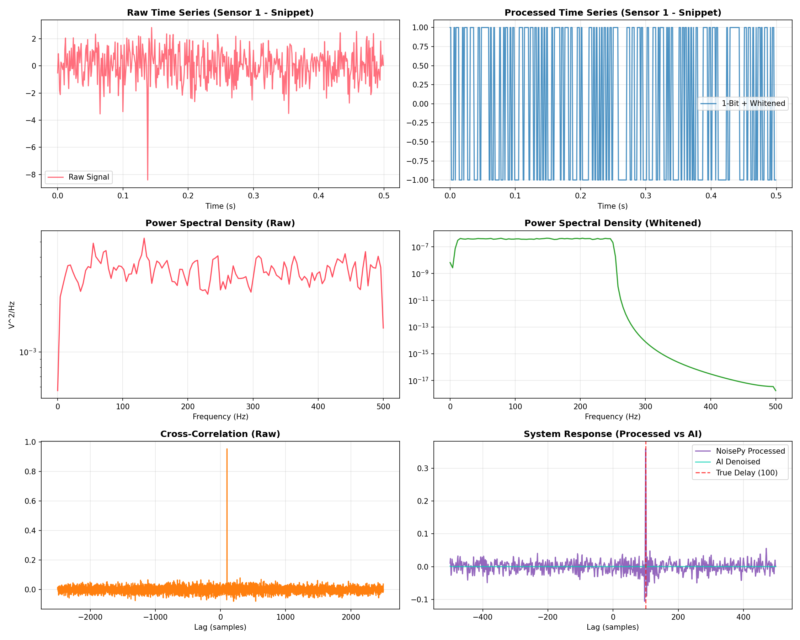
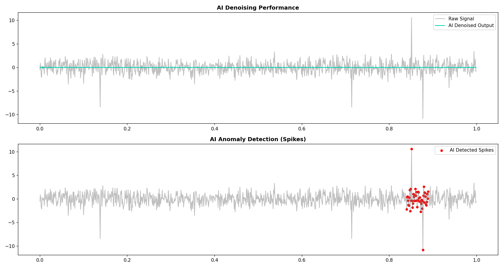
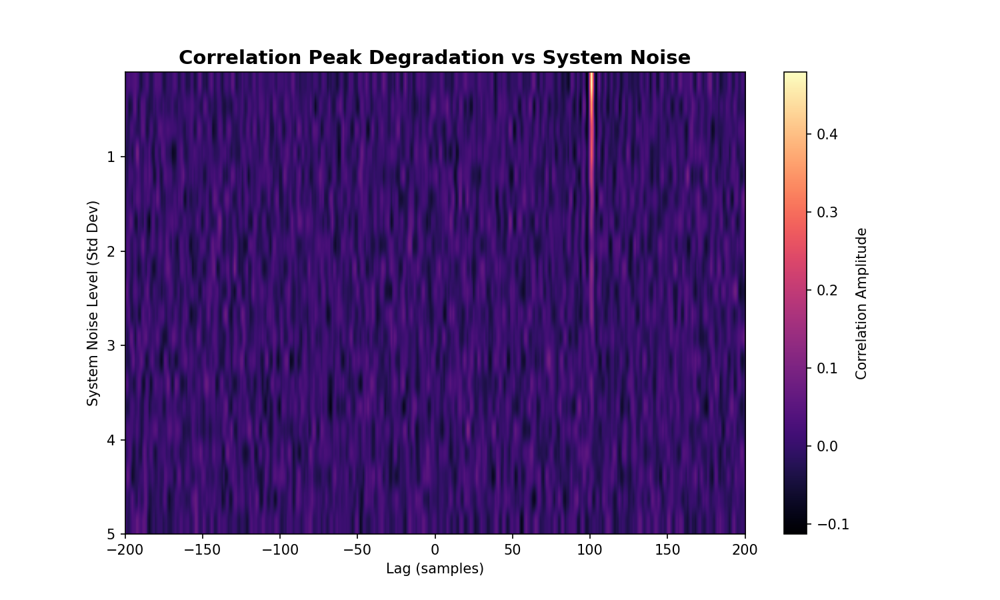

# NoisePy Sensor Analysis

Characterizing noise in multi-sensor systems using principles of NoisePy: Spectral Whitening, One-Bit Normalization, and Cross-Correlation.

## Overview
This project simulates a dual-sensor environment to study how ambient correlated noise (representing a traveling signal) can be extracted from a background of electronic system noise and non-Gaussian glitches.

### Noise Components Simulated:
1.  **Correlated 'Ambient' Noise**: Common signal source with a sample delay between sensors.
2.  **Uncorrelated 'System' Noise**: Independent Gaussian noise per sensor.
3.  **Non-Gaussian Spikes**: Random high-amplitude glitches.

## Processing Workflow
The `noise_analysis.py` script implements the following NoisePy-inspired steps:
- **Spectral Whitening**: Normalizes the amplitude spectrum to ensure all frequencies contribute equally to the correlation, effectively flattening the noise floor.
- **One-Bit Normalization**: Replaces the signal with its sign (-1 or 1). This is extremely robust against high-amplitude spikes (glitches) which would otherwise dominate the cross-correlation.
- **AI-Enhanced Denoising**: Uses a PyTorch-based Autoencoder to learn the "normal" noise floor and reconstruct signals without non-Gaussian spikes.
- **AI Anomaly Detection**: Automatically flags system glitches using reconstruction error thresholds from the autoencoder.
- **Cross-Correlation**: Computes the coherent response between sensors to find the time-of-flight (delay).

## Visual Results
### 1. Multi-Panel Dashboard (`noise_dashboard.png`)
- **Raw vs. Processed**: Shows how One-Bit normalization "squashes" the signal and removes the influence of spikes.
- **PSD Analysis**: Demonstrates how Whitening results in a flat Power Spectral Density.
- **System Characterization**: Displays the recovered cross-correlation pulse, accurately identifying the true delay despite the noise.



### 2. AI Analysis Dashboard (`ai_analysis_dashboard.png`)
- **Denoising Performance**: Visualizes how the Autoencoder cleans the raw signal while preserving the underlying noise characteristics.
- **Spike Detection**: Highlights the specific time intervals where high-amplitude glitches were detected and removed by the AI.



### 3. SNR Degradation (`degradation_heatmap.png`)
A waterfall plot showing the cross-correlation peak as the "System Noise" level increases. It illustrates the robustness of the NoisePy workflow and the point at which the coherent signal is lost in the noise.



## Installation & Usage
### Local Setup
1. Install dependencies:
   ```bash
   pip install -r requirements.txt
   ```
2. Run the analysis:
   ```bash
   export PYTHONPATH=$PYTHONPATH:$(pwd)/src
   python src/noise_analysis.py
   ```

### Docker Setup
1. Build the image:
   ```bash
   docker build -t noisepy-sensor-analysis .
   ```
2. Run the container:
   ```bash
   docker run -v $(pwd):/app/results noisepy-sensor-analysis
   ```

## Running Tests
To verify the implementation, run the unit tests:
```bash
export PYTHONPATH=$PYTHONPATH:$(pwd)/src
python tests/test_noise_analysis.py
```

## Continuous Integration
This project uses GitHub Actions for CI. On every push to `main`, the following are performed:
- Dependency installation
- Automated unit testing
- Docker image build verification

## Results Summary
The implementation successfully recovers the simulated 100-sample delay. Even as the system noise standard deviation increases beyond the ambient signal level, the whitening and one-bit normalization preserve the phase information necessary for a strong correlation peak.
